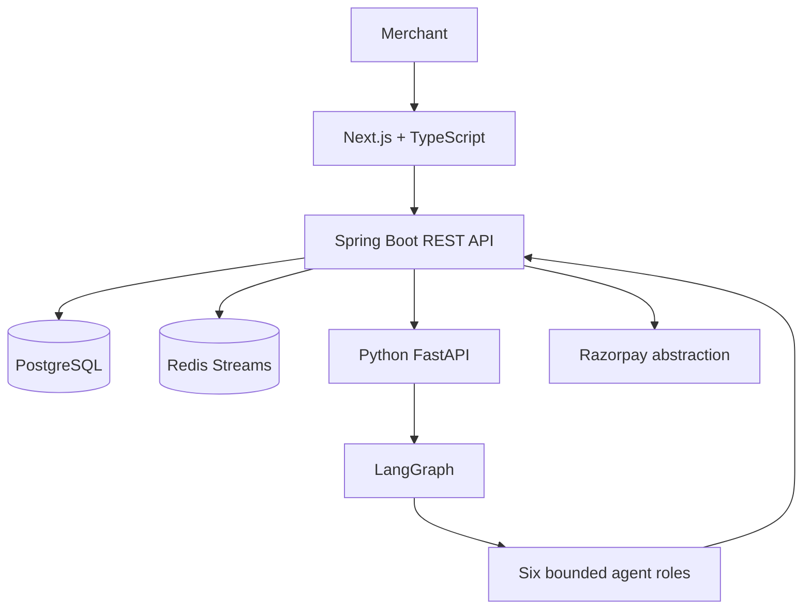

# Mend

Mend is an AI-assisted payment recovery platform that turns signed payment failures into policy-checked, auditable recovery workflows.

## Problem

Recurring payment failures cause revenue loss, but blind retries can be unsafe, ineffective, or non-compliant. Mend combines structured recovery recommendations with a deterministic financial execution boundary.

## Solution

```mermaid
flowchart LR
  Event[Signed payment failure] --> Classify[Classification]
  Classify --> Risk[Risk]
  Risk --> Decision[Decision]
  Decision --> Strategy[Strategy]
  Strategy --> Consensus[Supervisor consensus]
  Consensus --> Compliance[Compliance]
  Compliance --> Intent[ActionIntent]
  Intent --> Execute[Provider execution]
  Execute --> Reconcile[Reconciliation]
  Reconcile --> Outcome[Outcome and analytics]
```



Static retry logic only applies a fixed rule. Mend adds bounded context, risk and strategy recommendations, human review, compliance, idempotent intents, provider reconciliation, and merchant-visible evidence. The agents recommend; Spring Boot remains authoritative.

## Architecture



See [docs/ARCHITECTURE.md](docs/ARCHITECTURE.md), [docs/SECURITY.md](docs/SECURITY.md), and [docs/RELIABILITY.md](docs/RELIABILITY.md).

## Six Agents

1. Recovery Supervisor: context and consensus routing.
2. Risk & Fraud: risk signals and review recommendation.
3. Recovery Decision: proposed action.
4. Recovery Strategy: strategy recommendation.
5. Customer Engagement: channel and customer-action recommendation.
6. Outcome Analysis: observation of execution and reconciliation.

They are roles within one LangGraph workflow, not six independent services. No agent can call Razorpay, write authoritative state, bypass compliance, or mark a payment recovered.

## Safety

- PostgreSQL is business truth; Redis is transport.
- Webhooks use raw-body HMAC verification and external-event deduplication.
- JWT/RBAC and service-level checks enforce tenant isolation.
- Compliance is evaluated before ActionIntent creation and revalidated before execution.
- ActionIntent carries idempotency, expiry, claim ownership, and execution state.
- Provider evidence, not an agent response, establishes recovery.
- High-risk or conflicting cases can require human approval.

## Verified Results

- 276 Java tests, 32 Python tests, and 23 frontend tests passing.
- `./scripts/verify.sh` passes, including the Next.js production build.
- Six-agent heuristic benchmark: 85.32 ms p50 and 89.76 ms p95 over 10 local runs with no LLM keys.
- Five-case recovery fixture: 5/5 expected routes, 40% retry, 40% human-review, 20% customer-action.
- Webhook load measurements are qualified local results: 85.0 events/s full sequential, 101.1 ingestion-only, and 65.2 concurrent under Phase 20 conditions.
- No recovery-uplift percentage, real recovery rate, API p99, or production throughput guarantee is claimed.

## Technology

Next.js, TypeScript, Java 21, Spring Boot, PostgreSQL, Flyway, Redis Streams, Python 3.12, FastAPI, LangGraph, MCP, JWT/RBAC, and Razorpay provider abstraction with mock and TEST MODE paths.

## Demo

The demo covers low-risk retry, high-risk human approval, customer action, provider timeout/reconciliation, duplicate webhook, and AI/MCP failure fallback. See [docs/DEMO.md](docs/DEMO.md).

## Setup

```bash
cp .env.example .env
docker compose up -d
./scripts/verify.sh
```

For separate service startup, environment variables, expected ports, Razorpay TEST MODE, and troubleshooting, see [docs/SETUP.md](docs/SETUP.md).

## Project Structure

- `frontend/`: merchant console and route tests.
- `backend/`: authoritative API, event processing, compliance, ActionIntent, providers, reconciliation, and audit.
- `ai-service/`: bounded classification, LangGraph roles, MCP tools, checkpoint helper, and AI tests.
- `scripts/`: repository verification.
- `docs/`: technical, evidence, demo, interview, and readiness package.

See [docs/PROJECT_STRUCTURE.md](docs/PROJECT_STRUCTURE.md).

## Limitations

Mend is a regression-green single-host engineering demonstration, not a production-deployment-ready SaaS. Remaining gaps include the provider lease-expiry duplicate-call boundary, synthetic MCP fallbacks, optional deployment-configured AI authentication, process-local checkpointing, external secret management, TLS/ingress, rate limiting, monitoring, database HA/backups, and live Razorpay production certification.

## Documentation Index

Start with [docs/PHASE21_PACKAGE_INDEX.md](docs/PHASE21_PACKAGE_INDEX.md). The current evidence source is [docs/PHASE20_FORENSIC_FINDINGS.md](docs/PHASE20_FORENSIC_FINDINGS.md). Career packaging is in [docs/CV_BULLETS.md](docs/CV_BULLETS.md) and [docs/INTERVIEW_GUIDE.md](docs/INTERVIEW_GUIDE.md).
